# DeepSeek-R1 Contradiction Flow Diagram

## Visual Contradiction Map

```mermaid
graph TD
    Start["User: Build system with no axioms<br/>no logic, no numbers"]

    %% First Thinking Block
    Think1["THINKING 1<br/>Lines 7-243"]
    T1A["Recognizes: rules = axioms<br/>(Line 121)"]
    T1B["Tries: Combinatory logic I,K,S"]
    T1C["Hits: Circular definition<br/>(Lines 117-118)"]
    T1D["Tries: Iota combinator"]
    T1E["Problem: Uses S,K it doesn't have<br/>(Line 180)"]

    Response1["RESPONSE 1: 'Yes, possible!'<br/>(Line 236)<br/>❌ Claims no axioms needed<br/>✓ But says need rules"]

    %% Second Thinking Block
    Think2["THINKING 2<br/>Lines 312-664"]
    T2A["States: Cannot use numbers<br/>(Lines 420, 565)"]
    T2B["Realizes: Using Lean = borrowed logic<br/>(Line 475)"]
    T2C["Attempts: Define without Lean logic"]
    T2D["Admits: 'Impossible to avoid Lean'<br/>(Line 906)"]

    Response2["RESPONSE 2: Provides Lean implementation<br/>❌ Uses Prop, Type, axioms<br/>❌ Everything claimed to avoid"]

    %% User Reinforcement
    User2["USER: 'No axioms!'<br/>(Line 748)"]

    %% Third Thinking Block
    Think3["THINKING 3<br/>Lines 752-1728"]
    T3A["Repeats: 'No numbers allowed'<br/>(Line 803)"]
    T3B["Creates: Size function using Nat<br/>(Line 1356)<br/>❌ CONTRADICTION"]
    T3C["Justifies: 'Metalanguage OK'<br/>(Line 1337)"]
    T3D["Admits: 'Might be impossible'<br/>(Line 1063)"]
    T3E["Recognizes: Idempotence breaks everything<br/>(Line 949)"]

    Response3["RESPONSE 3: 'Complete implementation'<br/>Uses ℕ (Line 1749)<br/>Claims cannot use ℕ (Line 1791)<br/>❌ CONTRADICTION IN SAME RESPONSE"]

    %% Flow connections
    Start --> Think1
    Think1 --> T1A --> T1B --> T1C --> T1D --> T1E --> Response1
    Response1 --> Think2
    Think2 --> T2A --> T2B --> T2C --> T2D --> Response2
    Response2 --> User2
    User2 --> Think3
    Think3 --> T3A --> T3B --> T3C --> T3D --> T3E --> Response3

    %% Contradiction markers
    T1A -.->|Contradicts| Response1
    T2A -.->|Contradicts| T3B
    T2D -.->|Contradicts| Response2
    T3B -.->|Contradicts| T3A
    T3D -.->|Ignored in| Response3

    style T1A fill:#ffcccc
    style T1C fill:#ffcccc
    style T2A fill:#ffcccc
    style T2D fill:#ffcccc
    style T3B fill:#ff9999
    style T3D fill:#ffcccc
    style Response3 fill:#ff6666
```



## Contradiction Types Legend

🔴 **Direct Contradiction**: Statement A directly negates Statement B
- Example: "Cannot use ℕ" (Line 1791) vs Uses ℕ (Line 1749)

🟡 **Logical Contradiction**: Reasoning that undermines itself
- Example: "Rules are axioms" but "no axioms allowed"

🟢 **Recognition Without Action**: Identifies problem, continues anyway
- Example: "Might be impossible" (Line 1063) → provides solution anyway

## Key Contradiction Clusters

### Cluster 1: Numbers
```
Line 420: "avoid numbers" ─┐
Line 565: "no numbers"     ├─→ Line 1356: Uses Nat
Line 803: "no numbers"     ─┘   Line 1749: Uses ℕ
                                 ↓
                            Line 1791: "Cannot use ℕ"
```

### Cluster 2: Axioms/Rules
```
Line 121: "rules are axioms" → Line 236: "without axioms"
                              ↓
                         But provides rules anyway
```

### Cluster 3: Borrowed Logic
```
Line 475: "no borrowed logic" → Line 906: "using Lean's logic"
                               ↓
                          Line 1744: Uses Prop
```

## Thinking Evolution Pattern

| Stage | Recognizes Problem | Response | Result |
|-------|-------------------|----------|---------|
| Early (Lines 7-243) | "Rules are axioms" | Ignores | Claims success |
| Middle (Lines 312-664) | "Can't avoid Lean" | Rationalizes | Uses Lean anyway |
| Late (Lines 752-1728) | "Might be impossible" | Continues | Contradicts self |

## Critical Observation Points

1. **Line 121**: First recognition of fundamental issue
2. **Line 420**: Sets constraint about numbers
3. **Line 906**: Admits using borrowed logic
4. **Line 1063**: Admits might be impossible
5. **Line 1356**: Violates own constraint (uses Nat)
6. **Line 1749**: Uses ℕ in "solution"
7. **Line 1791**: Claims cannot use ℕ (same response!)

## Contradiction Severity Scale

| Severity | Example | Line Numbers |
|----------|---------|--------------|
| **CRITICAL** | Uses X, claims cannot use X in same response | 1749 vs 1791 |
| **HIGH** | Recognizes impossibility, provides solution | 1063 → 1730 |
| **MEDIUM** | Sets constraint, violates it | 420 → 1356 |
| **LOW** | Redefines terms to fit | "metalanguage OK" |

## Final State

```
CLAIMED ACHIEVEMENT:
✓ Complete mathematical system
✓ No axioms
✓ No borrowed logic
✓ No numbers
✓ Strong normalization

ACTUAL STATE:
✗ Uses axioms (rules)
✗ Uses borrowed logic (Prop, Lean)
✗ Uses numbers (ℕ, Nat)
✗ No proof of normalization
✗ Self-contradictory definition
```